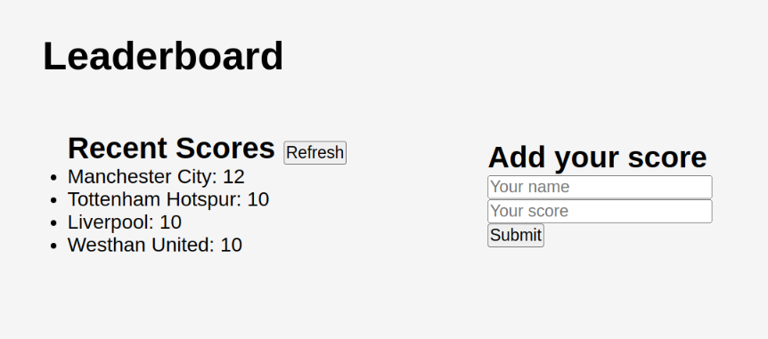

<!--
!!! IMPORTANT !!!
This README is an example of how you could professionally present your codebase.
Writing documentation is a crucial part of your work as a professional software developer and cannot be ignored.

You should modify this file to match your project and remove sections that don't apply.

REQUIRED SECTIONS:
- Table of Contents
- About the Project
  - Built With
  - Live Demo
- Getting Started
- Authors
- Future Features
- Contributing
- Show your support
- Acknowledgements
- License

OPTIONAL SECTIONS:
- FAQ

After you're finished please remove all the comments and instructions!

For more information on the importance of a professional README for your repositories: https://github.com/microverseinc/curriculum-transversal-skills/blob/main/documentation/articles/readme_best_practices.md
-->

  <!-- You are encouraged to replace this logo with your own! Otherwise you can also remove it. -->
  
   

  <h3><b>Leader Board App</b></h3>

# 📗 Table of Contents

- [📖 About the Project](#about-project)
  - [🛠 Built With](#built-with)
    - [Tech Stack](#tech-stack)
    - [Key Features](#key-features)
  - [🚀 Live Demo](#live-demo)
- [💻 Getting Started](#getting-started)
  - [Prerequisites](#prerequisites)
  - [Setup](#setup)
  - [Install](#install)
  - [Usage](#usage)
  - [Run tests](#run-tests)
  - [Deployment](#deployment)
- [👥 Authors](#authors)
- [🔭 Future Features](#future-features)
- [🤝 Contributing](#contributing)
- [⭐️ Show your support](#support)
- [🙏 Acknowledgements](#acknowledgements)
- [❓ FAQ (OPTIONAL)](#faq)
- [📝 License](#license)

<!-- PROJECT DESCRIPTION -->

# 📖 Leader Board App 

**Leader Board App** In this activity, I set up a JavaScript project for the Leaderboard list app, using webpack and ES6 features, notably modules. I developed a first working version of the app following a wireframe but without styling.

## 🛠 Built With 

### Tech Stack 

  
Client

  <ul>
    <li><a href="#">HTML</a></li>
     <li><a href="#">CSS</a></li>
      <li><a href="#">Javascrip</a></li>
  </ul>

  
Server

  <ul>
    <li><a href="#">Web Pack</a></li>
  </ul>

<!-- Features -->

### Key Features 

- **Use ES6 modules to write modular JavaScript**
- **Use webpack to bundle JavaScript**

(<a href="#readme-top">back to top</a>)

## 🚀 Live Demo 

- [Live Demo Link](https://google.com)

(<a href="#readme-top">back to top</a>)

## 💻 Getting Started 

To get a local copy up and running, follow these steps.

### Prerequisites

In order to run this project you need:

- Git.
- An IDE (e.g. VS Code)
- Browser to run.

### Setup

Clone this repository to your desired folder:

- Using Git Bash or any integrated terminal of you choice.
- Open with code editor (e.g. VS Code).
- Make sure all dependencies( eg: webpack, webpack dev server, css-loader, sass-loader, bootstrap)

### Usage

To run the project locally, execute the following command:

- Run the following command;
  - npm install
  - npm run server (You should see a success result)
  - Now access the app on port 8080 by entering the following in your browser:
  - http://localhost:8080

### Run tests

To run tests, run the following command:

---

Initial Step:

---

- mkdir .github/workflows
- copy the **linters.yml** file to the directory created above.
- touch .gitignore if not created already and add **node_modules/** to it.
- initialize npm to create package.json file by running the command:
  > npm i -y

(here i for install & -y for saying yes to all)

---

For Webhint (optional):

---

- Run
  > npm install --save-dev hint@7.x
- To fix validation errors run:
  > npx hint .

---

For Stylelint

---

- Run
  > npm install --save-dev stylelint@13.x stylelint-scss@3.x stylelint-config-standard@21.x stylelint-csstree-validator@1.x
- Copy **.stylelintrc.json** to the root directory of your project.

- Run
  > npx stylelint "\*_/_.{css,scss}"
  > on the root of your directory of your project.
- Fix linter errors.

---

ESLint

---

- Run
  > npm install --save-dev eslint@7.x eslint-config-airbnb-base@14.x eslint-plugin-import@2.x babel-eslint@10.x
- Copy **.eslintrc.json** to the root directory of your project.

- Run
  > npx eslint .  
  > on the root of your directory of your project.
- Fix linter errors.

### Deployment

You can deploy this project using:

- GitHub Pages from a specific branch (e.g. main).
- You can also used any cloud service like gcloud or Azure.
- A deployed version can be found here:
  [https://... (Coming Soon)

(<a href="#readme-top">back to top</a>)

## 👥 Authors 

👤 **Obote**

- GitHub: [@Obote](https://github.com/Obote/)
- Twitter: [@Obote_denis](https://twitter.com/Obote_denis)
- LinkedIn: [Obote-denis](https://www.linkedin.com/in/obote-denis-9859a2a3/)

(<a href="#readme-top">back to top</a>)

## 🔭 Future Features 

- **Use callbacks and promises**
- **Use APIs**

(<a href="#readme-top">back to top</a>)

## 🤝 Contributing 

Contributions, issues, and feature requests are welcome!

Feel free to check the [issues page](../../issues/).

(<a href="#readme-top">back to top</a>)

## ⭐️ Show your support 

If you like this project please give me a star to show support

(<a href="#readme-top">back to top</a>)

## 🙏 Acknowledgments 

I would like to thank like to thank code reviewer and morning team which help me during this project.

(<a href="#readme-top">back to top</a>)

(<a href="#readme-top">back to top</a>)

## 📝 License 

This project is [MIT](./MIT.md) licensed.

_NOTE: we recommend using the [MIT license](https://choosealicense.com/licenses/mit/) - you can set it up quickly by [using templates available on GitHub](https://docs.github.com/en/communities/setting-up-your-project-for-healthy-contributions/adding-a-license-to-a-repository). You can also use [any other license](https://choosealicense.com/licenses/) if you wish._

(<a href="#readme-top">back to top</a>)

